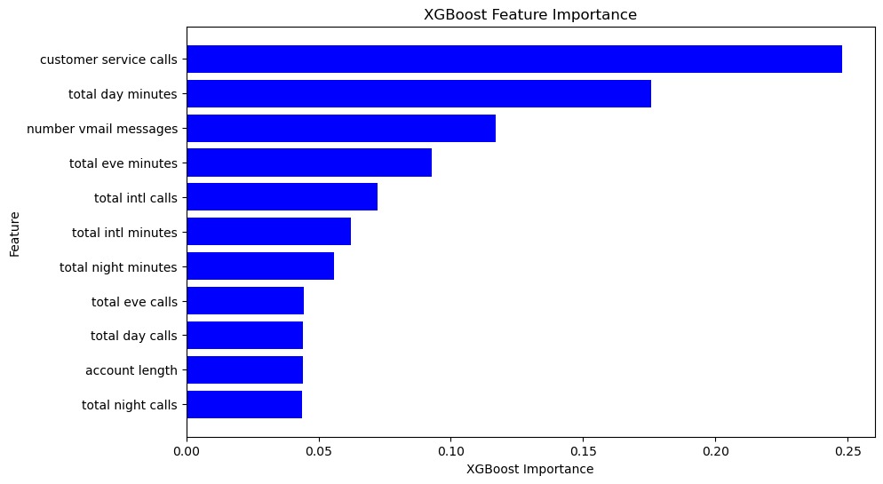

# SyriaTel Predictive Analysis of Customer Churn

## Introduction

SyriaTel a telecommunications company based in Damascus, Syria, faces a significant challenge in reducing customer churn, which can adversely impact its revenue and overall profitability. Customer churn refers to the phenomenon where customers terminate their subscriptions, often switching to competitors or discontinuing the service altogether. Poor service quality and customer support are primary drivers of customer churn. Additionally, the ease with which customers can switch providers and subpar customer service experiences, such as needing multiple contacts to resolve issues, substantially contribute to high churn rates. These factors highlight the importance of prioritizing service quality and improving customer satisfaction to effectively reduce churn.

This project focuses on building a classifier to predict whether a customer will soon stop doing business with SyriaTel. It aims to develop a model that accurately predicts customers likely to churn and identifies the key features driving these predictions, thereby providing actionable insights to SyriaTel to reduce churn.

### Notebook Structure

1. Business Understanding
2. Data Understanding
3. Data Cleaning
4. Exploratory Data Analysis
5. Data Preparation
6. Modelling
7. Evaluation
8. Conclusion

## 1. Business Understanding

### Stakeholders and Their Interests

The key stakeholder is the SyriaTel Telecom Business, interested in predicting customer churn patterns and finding ways to reduce it.

**Benefits for SyriaTel:**

- **Informed Decision-Making:** Utilize data-driven insights to reduce losses from customer churn.
- **Tailored Advice:** Receive customized recommendations based on SyriaTel's unique features and strengths.
- **Minimized Churn and Losses:** Understand the do's and don'ts to minimize customer churn, which leads to reduced revenue losses.

### Objectives

#### Main Objective

The main objective of this project is to build a predictive classifier that assists SyriaTel in determining if there is a predictable pattern to customer churning. The classifier aims to predict the potential predictable patterns of customer churning.

#### Specific Objectives

1. Identify key factors influencing customer churning from the telecommunication company.
2. Evaluate the classifier performance for the classification problem using metrics such as accuracy, precision, recall, F1 score, and confusion matrix to assess the effectiveness of the model.
3. Provide actionable recommendations to SyriaTel to reduce revenue lost due to customer churn.

## 2. Data Understanding

The data utilized for this project has been sourced from [Kaggle](https://www.kaggle.com/becksddf/churn-in-telecoms-dataset). The dataset contains 3,333 entries and 21 columns, providing detailed information on various aspects of customer accounts and usage. These include the state, account length, area code, phone number, international plan, voice mail plan, number of voice mail messages, total day minutes, total day calls, total day charge, total evening minutes, total evening calls, total evening charge, total night minutes, total night calls, total night charge, total international minutes, total international calls, total international charge, customer service calls, and churn status.

### Summary of Features in the Dataset

| Attribute                | Description                                                                                     |
|--------------------------|-------------------------------------------------------------------------------------------------|
| State                    | The state in which the customer resides.                                                       |
| Account Length           | The number of days the customer has had the account.                                             |
| Area Code                | The area code of the customer's phone number.                                                    |
| Phone Number             | The customer's phone number.                                                                    |
| International Plan       | A boolean indicating whether the customer has the international calling plan (True or False).   |
| Voice Mail Plan          | A boolean indicating whether the customer has the voicemail plan (True or False).               |
| Number Vmail Messages    | The number of voicemail messages the customer has sent.                                          |
| Total Day Minutes        | The total number of minutes the customer has been in calls during the day.                        |
| Total Day Calls          | The total number of calls the customer has made during the day.                                   |
| Total Day Charge         | The total amount of money charged by the telecom company for calls during the day.               |
| Total Eve Minutes        | The total number of minutes the customer has been in calls during the evening.                    |
| Total Eve Calls          | The total number of calls the customer has made during the evening.                               |
| Total Eve Charge         | The total amount of money charged by the telecom company for calls during the evening.           |
| Total Night Minutes      | The total number of minutes the customer has been in calls during the night.                      |
| Total Night Calls        | The total number of calls the customer has made during the night.                                  |
| Total Night Charge       | The total amount of money charged by the telecom company for calls during the night.             |
| Total Intl Minutes       | The total number of minutes the user has been in international calls.                             |
| Total Intl Calls         | The total number of international calls the customer has made.                                     |
| Total Intl Charge        | The total amount of money charged by the telecom company for international calls.                 |
| Customer Service Calls   | The number of calls the customer has made to customer service.                                     |
| Churn                    | A boolean indicating whether the customer terminated their contract (True or False).              |

### Data Types

- **Categorical Data:** Variables that represent categories or groups, such as 'state', 'phone number', 'international plan', and 'voice mail plan'.
- **Numerical Data:** Variables that represent numerical values, including both integer and floating-point numbers, such as 'account length', 'area code', 'number vmail messages', 'total day minutes', 'total day charge', 'total eve minutes', 'total eve charge', 'total night minutes', 'total night charge', 'total intl minutes', 'total intl charge', 'total day calls', 'total eve calls', 'total night calls', 'total intl calls', and 'customer service calls'.

### Data Relevance to the Project

The dataset contains various factors crucial for understanding customer behavior and forecasting churn for SyriaTel. Essential attributes include customer subscriptions like international plans and voice mail plans, as well as call usage statistics such as total day minutes and total night minutes. The 'Churn' column, which acts as the target variable, distinguishes between customers who have terminated their service ('True') and those who haven't ('False'). This comprehensive dataset lays the groundwork for building a predictive model to accurately identify churn risks and implement focused retention strategies. This aligns with the project's goal of effectively reducing customer churn.

### Independent and Dependent Variables

- **Dependent Variable:** 'Churn'
- **Independent Variables:** The remaining 20 features.

## 3. Data Cleaning and Pre-Processing

The data was loaded and assessed, after which some exploratory data analysis (EDA) was performed for better understanding. There were no missing values and no duplicates. All categorical features were transformed for one-hot encoding to make the data suitable for modeling. Numerical features were also normalized to equalize the features and improve model performance.

## 6. Modeling

The data was split into training and test datasets. The training data was used to fit the models, and the test data was used to evaluate them. The baseline model was created using Logistic Regression. Other models such as K-Nearest Neighbors (KNN), Decision Trees, Random Forest, and XGBoost were also used. Model tuning was performed by hyperparameter tuning or feature importance selection to come up with the best model.

## 7. Evaluation

### Best Model

The models used were:

1. Base Model - Logistic Regression
2. K-Nearest Neighbors (KNN)
3. Decision Trees
4. Random Forest Classifier
5. XGBoost

The best overall model proved to be the XGBoost model:

- **Test Accuracy:** 91.97%
- **Training Accuracy:** 95.64%
- **Test ROC and AUC Score:** 90%

### Top Five Features

The top five features crucial in determining customer churn were:

1. **Customer Service Calls:** The number of customer services calls made by a customer.
2. **Total Day Minutes:** The total amount of time the customer has spent on daytime calls in minutes.
3. **Number Vmail Messages:** The number of voicemail messages left by a customer.
4. **Total Eve Minutes:** The total number of minutes the customer has been in calls during the evening.
5. **Total Intl Calls:** The total number of international calls the customer has made.

### Were the Objectives Met?

**Main Objective**

Several predictive models were built, from which the top-performing one was selected as the best overall. The **XGBoost** model was chosen for its ability to predict customer churn patterns accurately.

**Specific Objectives**

1. Key factors influencing customer churning were identified as: customer service calls, total day minutes, number of voicemail messages, total evening minutes, and total international calls.
2. The classifiers were evaluated using metrics such as accuracy, precision, recall, F1 score, and confusion matrix, with XGBoost selected as the most effective.
3. Actionable recommendations were given based on the analysis.

**Yes, all objectives were met.**

## 8. Conclusion

### Recommendations

1. **Improve Customer Services:** Enhance services such as wait time and customer satisfaction.
2. **Introduce Customized and Affordable Call Plans:** Offer tailored plans for both day and night calls.
3. **Service Quality Improvement:** Continuously monitor and improve service quality metrics like network reliability, call quality, and data speed.
4. **Transparent Pricing:** Ensure clear pricing structures and billing processes to avoid disputes and dissatisfaction.
5. **Proactive Customer Outreach:** Regularly reach out to customers for feedback, addressing concerns, and offering assistance before they consider switching providers.
6. **Security Measures:** Implement stringent security measures to protect voicemail messages from unauthorized access, ensuring customer privacy and data protection.
7. **Expand International Plan Coverage:** Provide a wide range of countries covered by the international plan.
8. **Continuous Customer Churn Analysis:** Regularly conduct customer churn analysis to stay updated on churn patterns and strategies.

### Next Steps

1. **Deploy the Model:** Implement the churn prediction model into the operational environment for real-time predictions, enabling proactive retention strategies.
2. **Monitor and Update the Model:** Continuously track the model's performance and accuracy, updating it with new data to maintain relevance and accuracy.
3. **Interpret Model Insights:** Analyze the model's predictions to identify key factors influencing customer churn, providing valuable insights for targeted retention efforts and strategic decision-making.
4. **Collect More Diverse Data:** Expand the dataset by gathering a wider range of customer attributes, behaviors, and interactions to enhance the model's predictive capabilities.

### Repository Guide

- Notebook: [GitHub](https://github.com/clydeochieng/syriatel-churn)
- The dataset used: [Kaggle](https://www.kaggle.com/becksddf/churn-in-telecoms-dataset)

 
